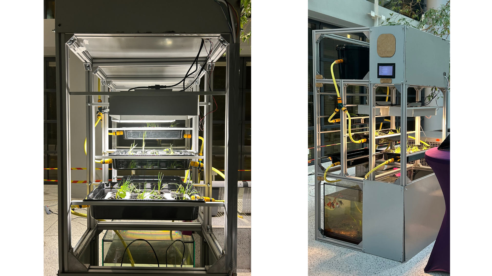

# aquaponics-platform
A modular and autonomous aquaponic system in the IFT - Institute for Future Technologies.

<p align="center">
  
</p>

## Goals
We realize this project as an innovation project for the IFT - under the supervision of our pricipal investigator Marc TEYSSIER, in the resilient futures research group.

We design this structure in an industrial way to maximize the production of leafy greens and fish, and modular to be able to adapt it to  different context.

--------

## Project Structure

To control the whole system, we are building a web app, that serve a web server launch on a raspberry pi. The user can see parameters of the system like the water temperature or its electroconductivity on a dashboard.

And modify for example the led intensity, or reduce the water flow, these user infos are processed by the server, stored in a backup file and then used on rasperry ports to modify these parameters.

The repository is organized as follows:

- `aqua-venv` the virtual env - that contain each dependencies.
- `aquaponic_launch.sh` a shell script to launch in one click the whole system (caution : this file need to be mofied following your folders architectures)
- `webserver/gpio.py` this code is running on the raspberry pi, and permit to get the sensors infos and modify the parameters of the system, using the raspberry ports.
- `webserver/webserver.py` thid file is enabling a server with flask, to control the aquaponic system even on a mobile connected to the same wifi hotspot. This server proposes a web page, a GUI, in return for a client connection (html/css/js in the static and templates folders)


## Usage
The commands are written in the shell file, despite here are the steps

1. Connect the rapsberry and your smartphone  on the same network (Wifi)

2. Launch the venv, gpio.py and webserver.py
```shell
source ./aqua-venv/bin/activate
cd webserver
python gpio.py &
python webserver.py
```
3.  The webserver is launched, you wil have the ip adress of your raspberry pi on the network and the port to listen to connect you to.
it will look like this for example on your terminal :
```shell
 * Running on http://192.168.1.84:8000
 ```

4. Go to this adress on your smartphone with your web browser

<p align="center">
  
</p>

## THANKS

<p align="center">
  
</p>
